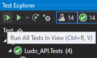
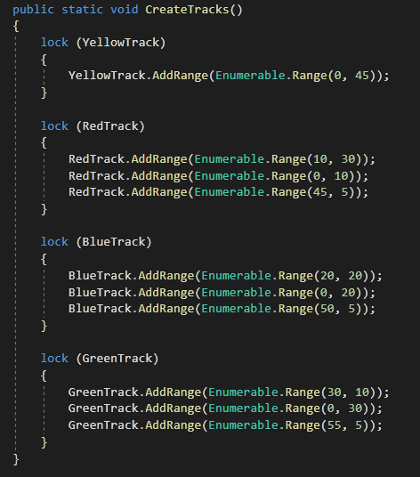
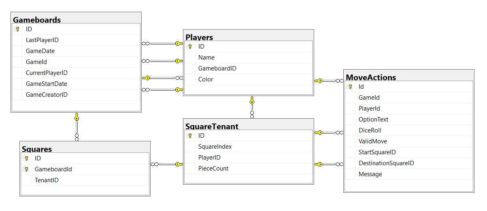

# Table of contents

- [Understanding the application](#Understanding&#32;the&#32;application)
  - [Application Structure Overview](#Application&#32;Structure&#32;Overview)
- [Process](#Process)
  - [Workflow](#Workflow)
  - [How we worked](#How-we-worked)
  - [Problems we encountered and how we solved them](Problemsn&#32;wen&#32;encounteredn&#32;andn&#32;hown&#32;wen&#32;solvedn&#32;them)
- [Endpoints](#Endpoints)
  - [Games](#Games)  
  - [Gameplay](#Gameplay)  
- [Source Structure](#Source&#32;Structure)  
- [Database Design](#Database&#32;Design)
- [Credits & Sources](#Credits-&-Sources)

<br>

---

# Understanding the application

The solution consists of 3 projects:

- Webb app  
This is the client application which holds the user interface such as the design of gameboard, menus and forms for creating or joining a game. When setting up a game, and during gameplay, the client calls the API with requests to recieve data such as a die roll, possible moves and results from choices depending on what actions the users decides to do.

  The API is called with generic GET and POST methods that is used with DTO models together with parameters to send the required data. Input is validated through model attributes.

  Cookies is used on the client side to keep track of who created the game and which players has joined a specific game.

- API  
The API is the server application which holds all the game logic for the ludo gameplay and handles the database connection. The data from the API can be retrieved by a client through the endpoints. How the endpoints are called is described in further down in the documentation.

  The API controllers is configured with dependency injection for services, and interfaces for repositories so that the unit tests doesn't depend or use production data.

- API tests  
This project holds manual tests with RestClient and automatic units tests for the endpoints.

## Application Structure Overview


<br>

---


# Process

## Workflow

We started out by making user stories to stake out a path for the process and get a picture of what we needed the solutuion to contain, we also set up a github project with task issues and cards and a to-do-list to break the process into smaller smaller tasks so we could keep track of our progress allways see what we had left to do.

We started the work on the solution by making 3 projects, one for the API and game engine logic, one for the webb client and one for tests.

The first projects we started working with was the API, get the database, controllers and repositories up with validated input, so that we could fetch data from the system. We also added tests to see that it worked.

When programming the gameplay logic we tried to recycle as much as we could from our previous project, but we hade to rewrite most of it as it was very attached to the console application of our old project.

We then moved on the user interface, starting with the gameboard adding functionality with a lobby and the abillity for other players to join the game.

## How we worked
We have mostly been working together on the project as we think that is the best way to solve problems, share knowledge and make each one involved in every part of the project.

Johan has however taken a larger responsibility twords the end of the project as we needed to get things done before deadline and he is the most experience one of us.

## Problems we encountered and how we solved them
We found that some tests would fail randomly when all tests in the test projects are run simultaneously with the "Run All Tests in View" button.



The fix for this was to lock the static properties "{Color}Track" (where {Color} is Yellow, Red, Green or Blue) while they were being populated.



<br>

---


# Endpoints

Endpoints availible in the API. Data is returned in JSON format.

- [GAMES](#Games)  
Endpoint for managing games and letting players start or join games

- [GAMEPLAY](#GAMEPLAY)  
Endpoint for handling gameplay once a game has started.

### GAMES
<br/>

**GET** /api/Games  
Get all game rows/entities from the database.
#### Rest Client example:  
```
GET localhost:44376/api/Games/
```
<br/>

**GET** /api/Games/{id}  
Path parameter: id (int)  
Find and return a {game} entity with the specified {id} from the database.
#### Rest Client example:  
```
GET https://localhost:44360/api/Games/1
```
<br/>

**GET** /api/LudoData  
Get Ludo data such as gameboard layout, player colors and their gameboard track indices.
#### Rest Client example:  
```
GET localhost:44376/api/Games/LudoData
```
<br/>

**POST** /api/New  
Create a new game and returns ID of the new gameboard whichs represents a game.  
Body parameter: A NewPlayerDTO object containing the name and chosen id of the player creating the game.
#### Rest Client example:  
```
POST https://localhost:44360/api/New
Content-Type: application/json

{
    "ID": 1,
    "PlayerName":"Player1",
    "PlayerColor":"Yellow"
}
```
<br/>

**DELETE** /api/Games/{id}  
Path parameter: id (int)  
Create a new game and returns ID of the new gameboard whichs represents a game.  
#### Rest Client example:  
```
DELETE https://localhost:44360/Games/1
Content-Type: application/json

```
<br/>

**POST** /api/Games/AddPlayer  
Add a new player to a game.  
Body parameter: A NewPlayerDTO object containing the name and color the player.
#### Rest Client example:  
```
POST localhost:44376/api/Games/AddPlayer
Content-Type: application/json
//apikey: apikey1234_visitor

{
    "GameId": 1,
    "PlayerName": "Player2",
    "PlayerColor": "Red"
}

```
<br/>

**POST** /api/Games/StartGame  
Starts a game.  
Body parameter: Game ID (int) to be started.
#### Rest Client example:  
```
POST localhost:44376/api/Games/StartGame
Content-Type: application/json

1

```
<br/>

## Gameplay
<br/>

**POST** /api/Gameplay/RollDie  
Rolls a die for the player and returns a list of actions availible for the player.  
Body parameter: A PostRollDieDTO object containing Game ID and Player ID.
#### Rest Client example:  
```
POST localhost:44376/api/Gameplay/RollDie
Content-Type: application/json

{
    "GameId": 1,
    "PlayerId": "1"
}
```
<br/>

**POST** /api/Gameplay/ChoseAction  
Send the ID of the chosen action by the player.  
Body parameter: ID (int) of the action the player has chosen.
#### Rest Client example:  
```
POST localhost:44376/api/Gameplay/ChoseAction
Content-Type: application/json

1
```
<br/>

**POST** /api/Gameplay/GetMoveActions  
Get a list of all availible actions for a die roll.  
Body parameter: A PostRollDieDTO object containing Game ID and Player ID.
#### Rest Client example:  
```
POST localhost:44376/api/Gameplay/GetMoveActions
Content-Type: application/json

{
    "GameId": 1,
    "PlayerId": "1"
}
```
<br/>

---

# Source Structure

Documentation of the source structure

- src/
    - docker-compose.yml
        > Defines our sql server database
    - Ludo_API/
        - Dockerfile
        - Ludo_API.xml
            > Autogenerated XML documentation using the XML comments ("///") defined in code
        - Program.cs
        - Startup.cs
        - API/
        - Controllers/
            > This contains the two API Controllers which manage our  two endpoints `api/games` and `api/gameplay`
            - GameplayController.cs
              > API Controller for the `api/gameplay` endpoint
              <br>
              > It is responsible for managing games, such as creating, retrieving and deleting a game or multiple games. And other related actions such as adding a player to an existing game
            - GamesController.cs
              > API Controller for the `api/games` endpoint
              > This controller is responsible for gameplay related actions, such as; starting a turn `PostRollDie` (which rolls a dice and generates possible moves based on the roll) and retrieving or executing `MoveAction`s.
        - Data/
            > This contains static game data such as the tracks for the various colors and the layout of the gameboard.
            - ColorTrackData.cs
              > This contains a color's track indices (the indices of the squares pieces of the color can move to and in which order), as well as the color's start and goal index.
            - ILudoData2.cs
              > Interface for LudoData2
            - LudoData.cs
              > This holds all data (readonly) for Ludo, such as gameboard layout (square color and square type) and a `ColorTrackData` for each color.
            - LudoData2.cs
              > rewrite of LudoData.cs (todo: fixme)
        - Database/
            > Contains our "DbContext".
            - LudoContext.cs
                > Here we define our entities/tables, and setup a composite primary key constraint in the `Square` table for the `ID` and `GameboardId` columns.
        - GameEngine/
            > This folder contains all gameplay related functionality.
            - GameEngine.cs
                > not used, todo: delete file
            - IGameEngine.cs
                > not used, todo: delete file
            - Game/
                > This folder contains all gameplay related functionality.
                - DieD6.cs
                    > This defines a 6 side die, and has one method for rolling the die, and one property to which the result is saved.
                - Game.cs
                    > The game's move logic is defined, such as generating possible moves.
                - GameOptions.cs
                    > not used, todo: delete file
                - IDie.cs
                    > Defines a die
                    <br>
                    > By defining a die with an interface and injecting an implementation as needed we can test any functionality which uses a die since the main implementation `DieD6` uses `Random` meaning that the outcome of the roll cannot be predicated and reliably tested.
                - ILudoGame.cs
                    > not used, todo: delete file
                - ITurnManager.cs
                    > Defines a TurnManager
                - PlayerManager.cs
                    > not used, todo: delete file
                - TurnManager.cs
                    > Our implementation of ITurnManager
                    <br>
                    > Holds functionality related to a game turn such as; randomly selecting which player should start (`DecideWhoStarts()`), figuring out which player should play the next turn, handling a turn (this involves rolling the die and then calling `Game.GetPossibleMoves` to generate a list of possible moves based on the result of the die roll) and starting a game (which involves calling `DecideWhoStarts()` and updating the `StartGameData` and `CurrentPlayer` properties on the `Gameboard` object.
        - Migrations/
            > Contains `Entity Framework Core` migrations.
        - Models/
            > Contains all domain/entity models and `DTO` classes
            - Gameboard.cs
                > This defines the `Gameboard` model (sometimes refereed to as "Game") which keeps track of all the squares and players, and other data such as; who created the game and when, and who the current player is. But it also defines the tracks for all colors.
                todo: update if we use LudoData/LudoData2 instead.
            - MoveAction.cs
                > This defines the `MoveAction` model which defines a possible move and as such holds all necessary data for completing a "MoveAction" (inserting [a] piece(s) or moving a piece.
            - Player.cs
                > This defines the `Player` model which holds a player's name and color, but also the player's track (based on their color).
            - Square.cs
                > This defines the `Square` model which holds a `SquareTenant` object and a reference to the `Gameboard` the square belongs to as well as a foreign key to said `Gameboard` object.
            - SquareTenant.cs
                > This defines the `SquareTenant` model which holds data (for a `Square`) on which player (if any) occupies a `Square` and how many pieces the player has on the `Square`.
            - DTO/
                - GameboardDTO.cs
                    > A cut down version of `Gameboard` for used return a `Gameboard`'s data in the response to an API request.
                - NewPlayerDTO.cs
                    >
                - PlayerDTO.cs
                    > A cut down version of `Player` for used return a `Gameboard`'s data in the response to an API request.
                - PostRollDieDTO.cs
                    >
                - SquareDTO.cs
                    > A cut down version of `Square` for used return a `Gameboard`'s data in the response to an API request.
                - TurnDataDTO.cs
                    >
        - Properties/
            - launchSettings.json
        - Repositories/
            > Contains our repository interfaces and their main implementations.
            - GamesRepository.cs
                > This repository handles all database queries for the `api/Games/` endpoint (`GamesController`) such as adding a new game (gameboard), adding a new player to an existing game or retrieving games (`Gameboard`s).
            - IGamesRepository.cs
                > Defines the repository for the `api/Games/` endpoint (`GamesController`).
            - IMoveActionsRepository.cs
                > Defines the repository for the `MoveActions` table.
            - IPlayerRepository.cs
                > Defines the repository for the `Players` table.
            - MoveActionsRepository.cs
                > This repository handles all database queries against the `MoveActions` table.
            - PlayerRepository.cs
                > This repository handles all database queries against the `Players` table.
        - Utils/
            - ShortGuid.cs
                > ShortGuid can be used to construct an URL friendly guid id string and to convert the ShortGuid back to a guid
        - Validators/
            - IsColor.cs
                > note: Not used, delete?
                
                > The class `IsColorAttribute` defines an attribute used to validate hex color strings.
    - Ludo_API_Test/
        - Helpers/
            - TestData.cs
                > note: Not used, delete?
        - ManualTests/
            > Contains Rest Client snippets for manual testing of the API.
            - RestClientTests.http
        - TestRepositories/
            > Test repositories. Implementations of the repository interfaces defined in WebApi.
            - TestGamesRepository.cs
            - TestMoveActionsRepository.cs
            - TestPlayerRepository.cs
        - UnitTests/
            > Contains our tests.
            - UnitTest_GameplayController.cs
                > Unit tests for the `api/Gameplay` endpoint controller.
            - UnitTest1.cs
                > Refactoring of these tests so that they work with the new code is incomplete.

                > Tests from the first Ludo project (Ludo v1).
            - UnitTest_GamesController.cs
                > Unit tests for the `api/Games` endpoint controller.
    - Ludo_WebApp/
        - Program.cs
            > The entry point in the WebApp. Creates the host builder, configures the default WebHost by registering our Startup class.
        - Startup.cs
            > Register and configure our dependencies and services. Configures Swagger. Sets up the pipeline.
        - Data/
            - GameboardConfigORM.cs
                > note: Not used, delete?
        - Hubs/
            > Hubs for SignalR
            - LudoHub.cs
        - Ludo_API/
            - Fetch.cs
                > The `Fetch` class contains methods to make API calls against the various endpoints.
            - Models/
                - LudoData.cs
                    > This holds all data for Ludo, such as gameboard layout (square color and square type) and a `ColorTrackData` for each color. This data is set by RestSharp when it deserializes the json data received when request the LudoData from the API.
        - Models/
            - Ludo.cs
                > note: Not used, delete?
            - MoveAction.cs
                > RestSharp creates MoveAction object when it deserializes json data from the API.
            - DTO/
                - GameboardDTO.cs
                    > RestSharp creates Gameboard object when it deserializes json data from the API.
                - NewPlayerDTO.cs
                    > RestSharp creates NewPlayer object when it deserializes json data from the API.
                - PlayerDTO.cs
                    > RestSharp creates Player object when it deserializes json data from the API.
                - PostRollDieDTO.cs
                    > RestSharp creates PostRollDie object when it deserializes json data from the API.
                - SquareDTO.cs
                    > RestSharp creates Square object when it deserializes json data from the API.
                - SquareTenantDTO.cs
                    > RestSharp creates SquareTenant object when it deserializes json data from the API.
                - TurnDataDTO.cs
                    > RestSharp creates TurnData object when it deserializes json data from the API.
        - Pages/
            - Error.cshtml
            - Error.cshtml.cs
            - Index.cshtml
                > Startpage of the WebApp
            - Index.cshtml.cs
                > Startpage of the WebApp
            - Privacy.cshtml
            - Privacy.cshtml.cs
            - _ViewImports.cshtml
            - _ViewStart.cshtml
            - Ludo/
                - Game.cshtml
                - Game.cshtml.cs
                - Index.cshtml
                    - Here the gameboard is drawn if a route id is specified and if there's a gameboard with said id.
                    - Display a "Cast Die" button for the player whose turn it is.
                    - Display a list of `MoveAction`s if the player has cast their die.
                - Index.cshtml.cs
                    - Loads LudoData and the Gameboard if the {id} is not null.
                    - Handles the POST when the "Cast Die" is clicked.
                    - Handles the POST when the MoveActions form is submitted.
                - Load.cshtml
                    > note: Not used, delete?
                - Load.cshtml.cs
                    > note: Not used, delete?
                - Lobby.cshtml
                    > Shows a form to create or join a game depending on whether {id} is null or not.
                    > Displays a list of player in a game (if {id} is not null)
                    > Presents a button which takes they player to the gameboard when the creator has started the game.
                - Lobby.cshtml.cs
                    - Handles the POST when the create/join game form is submitted.
                    - Handles the POST when "Start Game" button is clicked.
                - New.cshtml
                    > note: Not used, delete?
                - New.cshtml.cs
                    > note: Not used, delete?
            - Shared/
                - _Layout.cshtml
                - _ValidationScriptsPartial.cshtml
        - Properties/
            - launchSettings.json
            - serviceDependencies.local.json.user
        - Repositories/
            > note: Not used, delete?
            - ILudoApiRepository.cs
                > note: Not used, delete?
            - LudoApiRepository.cs
                > note: Not used, delete?
        - Utils/
            - CookieMonster.cs
                > Sets cookies, and surprisingly it doesn't eat any.
        - wwwroot/
            - css/
                - ludo.css
                    > Styles for the gameboard.
                - site.css
            - js/
                - ludo.js
                    > Scripts for the gameboard.
                - site.js

<br>

---


# Database Design

See [Source Structure](#Source&#32;Structure) section for detailed explenation on database models.



<br/>

---


# Credits & Sources
- Lazy loading **singleton** https://csharpindepth.com/Articles/Singleton#performance
- https://github.com/microsoft/referencesource/blob/5697c29004a34d80acdaf5742d7e699022c64ecd/System.Web/Routing/RouteValueDictionary.cs#L61
  - Used this to figure out how to convert an anonymous object (of query-parameters) to a dictionary. This is used in the method GetAsync<T> in [Fetch.cs](../src/Ludo_WebApp/Ludo_API/Fetch.cs) (in the WebApp-project).
